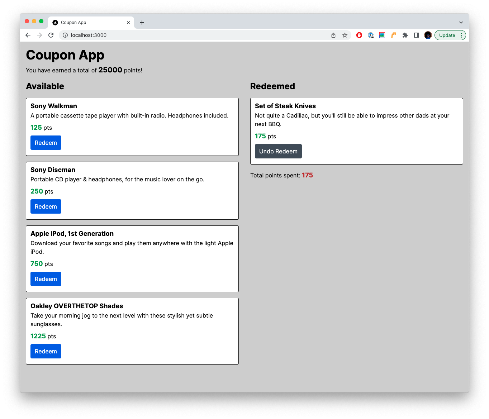

# Coupon App
A list of products with redemption values that can that can be redeemed at the click of a button. Redeeming a product will subtract its value from your point balance, and the redeemed product gets added to a list of redeemed products.

## Screenshot

* ReactJS
* Typescript
* TailwindCSS
* ToDo: GraphQL, make call to MongoDB, return couponData

# NextJS
This is a [Next.js](https://nextjs.org/) project bootstrapped with [`create-next-app`](https://github.com/vercel/next.js/tree/canary/packages/create-next-app).